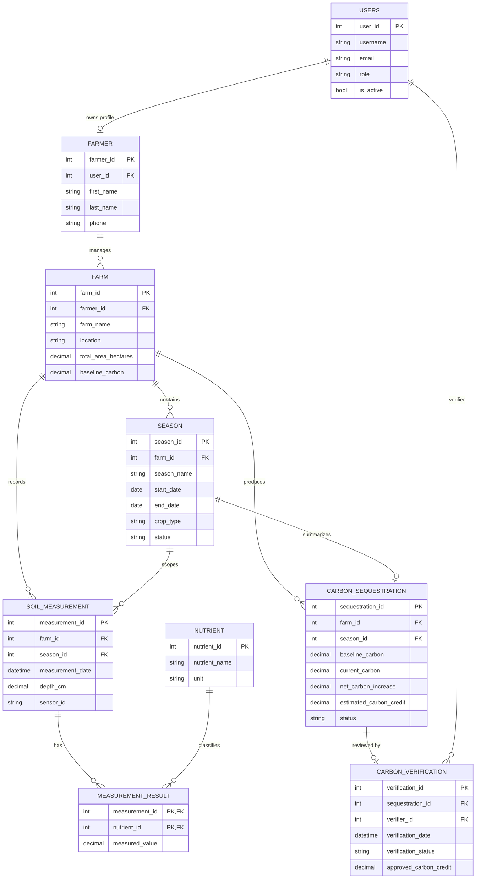

# Soil Carbon ER Diagram

The live schema stores land, soil, carbon, and certification workflow data through the following relational model.

## Certification Note

The certification state is stored through the combination of:

- `carbon_sequestration`
- `carbon_verification`
- linked season, farm, and measurement evidence

This means the reportable certification record is traceable back to both field measurements and verifier action.
